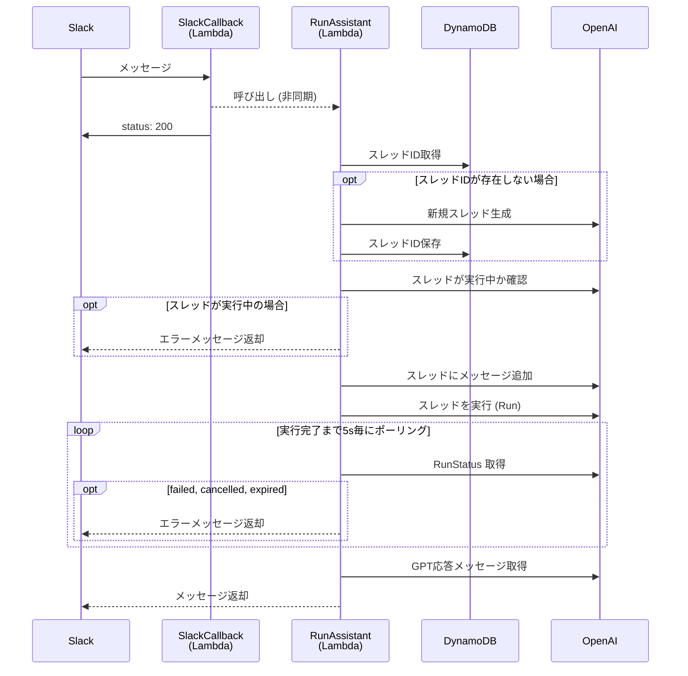

# slack-chatbot-with-openai-assistant
OpenAI AssistantAPI を利用した Slack チャットボット

```mermaid
sequenceDiagram
    participant Slack
    participant Callback as SlackCallback<br>(Lambda)
    participant Assistant as RunAssistant<br>(Lambda)
    participant DynamoDB
    participant OpenAI

    Slack->>Callback: メッセージ
    Callback-->>Assistant: 呼び出し (非同期)
    Callback->>Slack: status: 200
    Assistant->>DynamoDB: スレッドID取得
    opt スレッドIDが存在しない場合
        Assistant->>OpenAI: 新規スレッド生成
        Assistant->>DynamoDB: スレッドID保存
    end
    Assistant->>OpenAI: スレッドが実行中か確認
    opt スレッドが実行中の場合
        Assistant-->>Slack: エラーメッセージ返却
    end
    Assistant->>OpenAI: スレッドにメッセージ追加
    Assistant->>OpenAI: スレッドを実行 (Run)
    loop 実行完了まで5s毎にポーリング
        Assistant->>OpenAI: RunStatus 取得
        opt failed, cancelled, expired
            Assistant-->>Slack: エラーメッセージ返却
        end
    end
    Assistant->>OpenAI: GPT応答メッセージ取得
    Assistant-->>Slack: メッセージ返却
```
